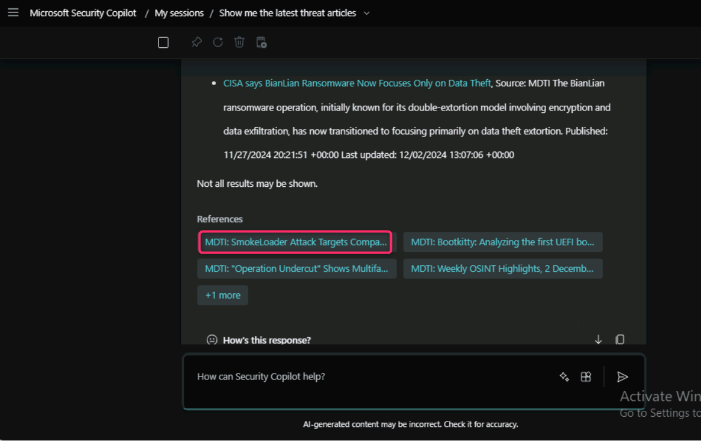

## **Lab 8 - Using Security Copilot standalone portal to get threat intelligence**

**Introduction**

Security Copilot delivers information about threat actors,
indicators of compromise (IOCs), tools, and vulnerabilities, as well as
contextual threat intelligence from Microsoft Defender Threat
Intelligence (Defender TI). You can use the prompts and promptbooks to
investigate incidents, enrich your hunting flows with threat
intelligence information, or gain more knowledge about your
organization. You can use many prompts to get information from Defender
TI.

**Objectives**

- To explore and access threat-related articles utilizing Microsoft
  Security Copilot Standalone.

- To obtain information about the Silk Typhoon threat actor and
  associated indicators of compromise (IOCs).

- To obtain information about Common Vulnerabilities and Exposures
  (CVEs).

- To provide feedback on the effectiveness and accuracy of the Defender
  Threat Intelligence integration with Security Copilot.

**Task 1: Exploring and accessing threat-related articles**

1.  In Microsoft Security Copilot Standalone, navigate and click on
    **Source** icon beside the prompt bar as shown in the below image.

 

2.  Ensure that the **Microsoft Threat Intelligence** plugin is
    turned on.

 

3.  Enter the following prompt to obtain the latest threat related
    articles.

 +++**Show me the latest threat articles**+++

4.  Carefully review the output. 

5. Click on the Reference article as shown in the below image, then go through the full analysis report.
   

5.  Then, enter the following prompt:

 +++**Get threat articles related to ransomware in the last six months**+++

6.  Review the latest threat intelligence articles related to ransomware
    over the past six months.

**Task 2: Threat actor mapping and infrastructure**

Get information on threat actors and the tactics, techniques, and
procedures (TTPs), sponsored states, industries, and IOCs associated
with them.

1.  Enter the following prompt, +++**Tell me more about Silk Typhoon**+++

 

2.  Carefully review the information related to Silk Typhoon.

 

 

 

3. Then, enter the following prompt, +++**Share the IOCs associated with Silk Typhoon**+++

4.  Review the IOCs associated with Silk Typhoon.

**Task 3: Vulnerability data by CVE**

Get contextual information and threat intelligence on Common
Vulnerabilities and Exposures (CVEs).

1.  Enter the following prompt, +++**Show me the latest CVEs**+++

2.  Review all the latest CVEs.

**Task 4: Provide feedback**

Your feedback on the Defender TI integration with Security Copilot
helps with development.

1.  To provide feedback, in Copilot, select **How's this response?** At
    the bottom of each completed prompt.

2.  Here, we are selecting **Looks right**. You can select the response
    based on your experience related to the output provided by Copilot
    for Security.

- **Looks right** - Select this button if the results are accurate,
  based on your assessment.

- **Needs improvement** - Select this button if any detail in the
  results is incorrect or incomplete, based on your assessment.

- **Inappropriate** - Select this button if the results contain
  questionable, ambiguous, or potentially harmful information.

3.  In **Send feedback to Microsoft** dialog box, select **Accurate**.

4.  Click on the **Send** button.

5.  You can see your feedback under the generated output of Copilot for
    Security.

**Summary**

In this lab, you’ve utilized Microsoft Security Copilot Standalone
to explore and access threat-related articles, enabling you to stay
updated on the latest cybersecurity trends and emerging threats. Then,
you’ve obtained valuable insights into the Silk Typhoon threat actor
including the associated indicators of compromise (IOCs), aiding in
understanding the threat landscape and potential risks. You’ve accessed
information about Common Vulnerabilities and Exposures (CVEs). Finally,
the lab emphasized the importance of providing feedback on the
effectiveness and accuracy of the Defender Threat Intelligence
integration with Security Copilot, contributing to the continuous
improvement of cybersecurity tools and solutions. Through these tasks,
you’ve gained practical experience in leveraging threat intelligence to
bolster the cybersecurity defenses and actively contributed to the
refinement of security practices.
