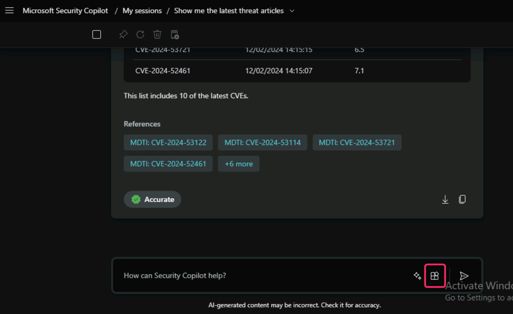
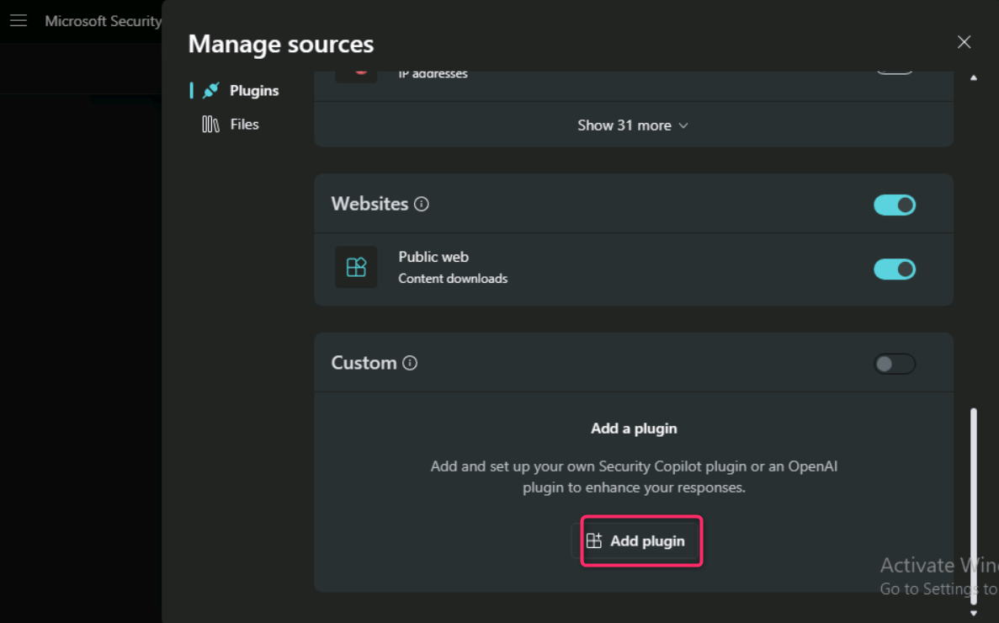
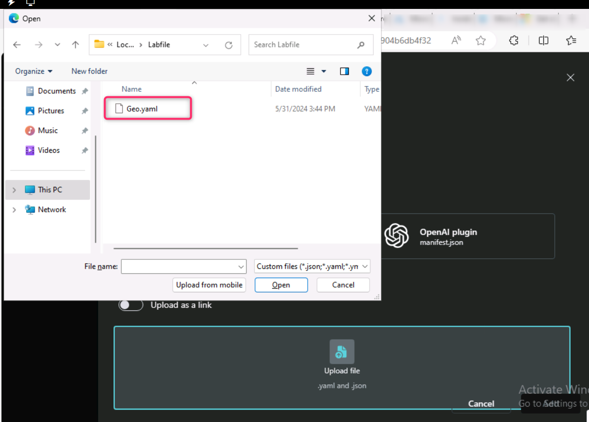

## **Lab 9: Adding custom plugins to extend the capabilities of Security Copilot**

**Introduction**

Security Copilot comes with many default plugins and supports
several non-Microsoft plugins. You can also extend Copilot for
Security's capabilities by adding or creating your own plugin. The
Security Copilot platform enables developers and users to write
plugins that can be invoked to perform specialized tasks.

**Objectives**

- To integrate a custom plugin into Microsoft Security Copilot
  Standalone and utilize it to query geolocation information for a
  specified IP address.

**Task 1: Integrating a custom plugin and obtaining complete information
of a specific IP address**

1.  In Microsoft Security Copilot Standalone, navigate and click on
    **Source** icon beside the prompt bar as shown in the below image.

 

2.  Scroll down to Custom section and click on **Add plugin** as shown
    in the below image.

 

 

3.  In the **Add a plugin** page, navigate and click on **Copilot for
    Security plugin**.

4.  Scroll down and click on **Upload file**.

5.  Navigate to **C:\Labfiles** and select **Geo.yaml** file.

6.  Then, click on **Open** button.

7.  After **Geo.yaml** file is successfully uploaded, click on the
    **Add** button.

8.  You will see that the customized plugin i.e., **IP Address
    Geolocation** is successfully added to Microsoft Copilot for
    Security Standalone.

9.  Go back to the prompt bar and enter the following prompt:

    +++**Tell me the geolocation of ip 173.252.167.50?**+++

10. You will get the complete information about the IP address city,
    region, country, latitudes and longitude coordinates, timezone,
    zipcode, etc.

**Summary**

In this lab, you’ve learned how to add custom plugins to Microsoft
Security Copilot. You’ve uploaded a Geo.yaml file and successfully
integrated the IP Address Geolocation plugin. Then, you’ve used a prompt
for a specific IP address and gained insights into its city, region,
country, coordinates, timezone, and zipcode, thereby enhancing your
proficiency in custom plugin integration and geolocation querying within
the Microsoft Security Copilot environment.
